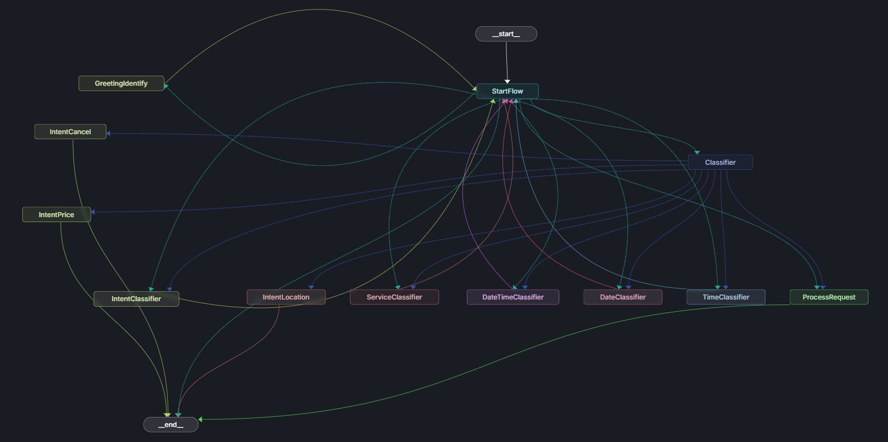
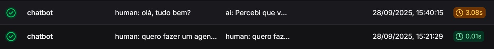

# Hyperlocal Conversational Orchestrator

Projeto base de um fluxo conversacional que integra um LLM (OpenAI / LangChain / LangGraph) com um componente de NER para extração de entidades de forma incremental e persistente. A arquitetura demonstra:

- Orquestração de diálogo usando LangGraph (estado baseado em `MessagesState`)
- Classificação de intenção + extração de entidades (NER externa)
- Persistência de histórico em arquivo (`FileChatMessageHistory`)
- Enriquecimento progressivo do contexto (service / intent / time / date)

O objetivo deste repositório é servir como um exemplo claro e direto para expansão de fluxos de conversação orientados a intenção + entidades.

## Visão Geral do Fluxo

Imagem do grafo (export LangGraph):



## Principais Tecnologias
- FastAPI (exposição HTTP)
- LangGraph + LangChain (gestão do fluxo e abstração de LLM)
- OpenAI (LLM para classificação e resposta)
- NER externo (API Hyperlocal) para extração de entidades
- Persistência de histórico com `FileChatMessageHistory`

## Rotas
| Método | Rota | Descrição |
|--------|------|-----------|
| POST | `/api/v1/conversation` | Processa uma interação conversacional. |

### Payload de Entrada
```json
{
  "session_id": "opcional-uuid",
  "message": "Quero agendar um corte amanhã às 14h"
}
```

### Exemplo de Resposta (simplificada)
```json
{
  "user_id": "<session_id>",
  "messages": [
    {"type": "text", "content": "Perfeito, para qual serviço?"},
    {"type": "text", "content": "Agendei seu corte para amanhã às 14:00."}
  ]
}
```

## Intenções Treinadas
Intenções base planejadas:
- AGENDAR
- CANCELAR
- CONSULTAR
- PREÇOS
- LOCALIZAÇÃO

Pelo curto tempo de desenvolvimento, somente o fluxo de **AGENDAMENTO** foi implementado integralmente. A mesma lógica de coleta incremental + validação pode ser replicada para as demais intenções reutilizando o nó de classificação e expandindo os ramos do grafo.

## Entidades Reconhecidas
Entidades alvo modeladas no NER:
- `SERVIÇOS`
- `DATA`
- `HORÁRIO`

### Serviços Treinados / Reconhecidos
- corte de cabelo
- corte
- sobrancelhas
- depilação
- depilação completa

A extração provê enriquecimento adicional (ex.: normalização de datas e horários) para permitir decisão no fluxo sem ambiguidades.

## Histórico de Conversa
Cada sessão é persistida em arquivo (`./src/history/storage/`) usando `FileChatMessageHistory`. Isso permite retomada de contexto e enriquecimento progressivo (ex.: primeiro serviço, depois data, depois horário).

Nota: Para fins de desenvolvimento do teste foi utilizada a camada file-based. Em produção, este mecanismo pode (e deve) ser substituído ou estendido por um cache / storage mais robusto como Redis (TTL + expiração de sessão), MongoDB (consulta flexível e agregações), ou qualquer outro banco NoSQL que favoreça baixa latência e escalabilidade horizontal para persistência e recuperação incremental das mensagens.

## Teste do Modelo NER
Você pode validar o modelo NER diretamente via interface Redoc em:

http://13.220.52.245/redoc

(O endpoint interno chamado pelo orquestrador está configurado via variável `HYPERLOCAL_NER_API_URL`).

## Execução (Resumo)

### 1. API FastAPI (Produção)
Este comando sobe o projeto FastAPI para ter acesso aos endpoints da API:
```bash
docker compose -f docker-compose-fastapi.yml up --build
```

### 2. LangGraph Playground (Desenvolvimento)
Para utilizar o playground visual do LangGraph e testar o fluxo interativamente:
```bash
docker compose up --build
```
Acesse: http://localhost:2024

### 3. Collection Postman (Testes de API)
Faça o download da Collection e Environment do Postman para testar as rotas da API:

- **Collection**: [Hyperlocal Conversation Collection](assets/postman/Hyperlocal%20Conversation%20API.postman_collection.json)
- **Environment**: [Hyperlocal Conversation Enviroment](assets/postman/Hyperlocal%20Local.postman_environment.json)

Com eles será possível testar facilmente todos os endpoints da API e realizar diferentes cenários de teste.
 
 Guia detalhado de uso das collections e environment (importação, cenários, troubleshooting): [Guia Postman](assets/postman/README.md)

### 4. Testando via cURL
Enviar requisição direta para o endpoint de conversação:
```bash
curl -X POST http://localhost:8081/api/v1/conversation \
  -H "Content-Type: application/json" \
  -d '{"message": "Quero agendar corte amanhã às 14h"}'
```

## Estrutura Simplificada
```
src/
  agents/
    nodes/        # Nós do LangGraph
    helpers/      # Funções utilitárias (NER, LLM, parsing)
    api/          # Cliente da API de NER externa
  history/        # Persistência de histórico (file-based)
  services/       # Serviço de conversação (entrada -> grafo -> resposta)
  controllers/    # FastAPI controllers
```

## Extensões Futuras
- Implementação dos fluxos: CANCELAR, CONSULTAR, PREÇOS, LOCALIZAÇÃO
- Normalização semântica de serviços (sinônimos / embedding)
- Mecanismo de fallback / desambiguação multi-turn

## Observabilidade
Optou-se pelo uso do LangSmith para inspeção de execuções (traces) do fluxo conversacional.

Para habilitar o tracing basta definir a variável de ambiente:

```
LANGSMITH_API_KEY=<sua_api_key>
```

Opcionalmente você pode definir (se estiver usando as variáveis padrão do ecossistema LangChain):
```
LANGCHAIN_PROJECT=hyperlocal-conversation
LANGCHAIN_TRACING_V2=true
```

Após isso, cada execução dos nós (LLM calls, NER chaining, classificadores) aparecerá no painel do LangSmith, permitindo depuração de prompts, latências e tokens consumidos.

### Visualização do Trace List
O painel mostra a lista de execuções com informações de tempo, tokens e custos:



### Detalhamento do Trace
Clicando em um trace específico, é possível visualizar o fluxo detalhado de execução dos nós, entrada/saída de cada LLM call, e tempo de resposta:


## Licença
Uso interno / educacional. Ajuste conforme necessidade corporativa.
